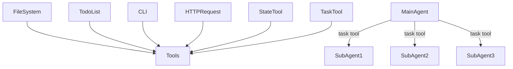

# 功能
## 规划
维护一个结构化的待办列表 todo list
维护多个任务的状态(pending,in_progress,completed,failed)

## 子代理
主代理通过 task 工具将任务委托给子代理
子代理拥有独立状态、独立上下文
子代理执行结束后决定将哪些内容返回主状态、主上下文

## 工具
### 本地工具
#### 命令行
- bash
#### 规划
- read_todo
- write_todo
- edit_todo
#### 文件系统
- ls
- read_file
- write_file
- edit_file
- grep
- glob
#### 网络请求
- http_request
#### 状态管理
- read_state
- write_state
#### 任务委派
- task
### MCP

## 状态管理
通过 .json 文件或者 sqlite 数据库存储会话状态
用户 access_token 存入状态

## 上下文管理

## 技能
https://platform.claude.com/docs/zh-CN/agents-and-tools/agent-skills/overview
### 渐进式披露
1. 技能元数据(始终加载)
SKILL.md 文件最顶端 yaml 格式的元数据，包含 name、description
2. 技能详细信息(技能触发时加载)
SKILL.md 文件所有内容
3. 资源与代码(按需加载)
附加技能目录或文件，在 SKILL.md 中引用

# 架构

# Benchmark
- BIRD-SQL
    https://bird-bench.github.io/
- Spider 2.0
    https://spider2-sql.github.io/
# 流程

